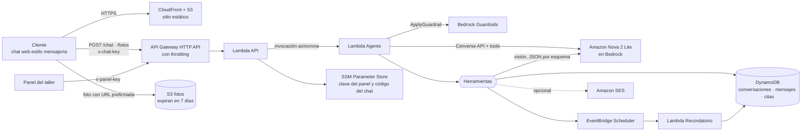

# AWS-Agent-Test · Agente de citas para un taller mecánico

Demo del taller práctico de la charla **"IA Generativa en 2026"** para AWS User Groups.

Un cliente escribe en un chat **con estilo de app de mensajería** y un agente de IA:

1. Obtiene la marca y el modelo del auto. Si el cliente no está seguro, puede mandar una **foto (opcional)**: el agente la identifica con visión y **le pide confirmación**.
2. Averigua qué servicio necesita y propone hasta 3 horarios reales, repartidos en el día.
3. Agenda la cita cuando el cliente acepta y **asigna un mecánico** según la especialidad y la carga de trabajo.
4. La cita aparece en el **panel del taller** en tiempo real.
5. Confirma en el chat (y por correo, si se configura) y programa un **recordatorio** automático.

> ⚠️ **Proyecto educativo, no apto para producción.** La interfaz *imita* una app de mensajería, pero **no usa WhatsApp ni ningún servicio de Meta**. Usa solo datos ficticios.

## Arquitectura



| Pieza | Servicio | Qué hace |
|---|---|---|
| Chat y panel | S3 + CloudFront | HTML/JS estático, sin build |
| Entrada | API Gateway HTTP API + Lambda | Revisa el código de acceso, valida, limita el ritmo y encola cada turno |
| Agente | Lambda + **Amazon Nova 2 Lite en Bedrock** (API Converse con `boto3`) | Loop de razonamiento con herramientas |
| Visión | Nova 2 Lite con una herramienta forzada (JSON por esquema) | Clasifica el vehículo de la foto |
| Seguridad | **Bedrock Guardrails** (`ApplyGuardrail`) | Filtros de contenido, ataques de prompt, tema denegado (fraude vehicular), bloqueo de tarjetas y contraseñas |
| Datos | DynamoDB (con TTL) | Conversaciones, mensajes y citas |
| Recordatorios | EventBridge Scheduler → Lambda | Mensaje en el chat (y correo opcional) |
| Correo | Amazon SES (opcional) | Confirmación y recordatorio |
| Auditoría | CloudWatch Logs | Cada llamada a herramienta queda registrada |

### Cómo piensa el agente

```
cliente escribe → Guardrail (entrada) → el modelo decide → herramienta → resultado → el modelo decide → … → Guardrail (salida) → chat
```

Herramientas (`backend/taller/herramientas.py`). Nova 2 Lite no tiene modo `strict` para herramientas, así que **cada entrada se valida contra su esquema en código** antes de ejecutarse: parámetros faltantes o de más, tipos y valores permitidos. Por ejemplo, un `"false"` como texto no pasa como confirmación.

| Herramienta | Regla que se valida **en código**, no solo en el prompt |
|---|---|
| `identificar_vehiculo` | La foto solo se lee desde la carpeta de esa conversación |
| `confirmar_vehiculo` | Requiere `confirmado_por_cliente = true`, con marca y modelo dichos por el cliente o confirmados después de la foto |
| `consultar_disponibilidad` | Horario del taller, 2 h de anticipación, máximo 30 días |
| `agendar_cita` | Vehículo confirmado, horario confirmado, máximo 2 citas activas y reserva atómica del horario |
| `mis_citas` / `cancelar_cita` | Solo las citas del teléfono de la conversación, con confirmación |
| `cargar_skill` | Solo skills del catálogo local |

### Skills

`backend/taller/skills/*/SKILL.md` sigue el formato abierto de [Agent Skills](https://agentskills.io): un encabezado YAML (`name`, `description`) y las instrucciones en Markdown. El agente solo ve el **nombre y la descripción** de cada skill, y carga el contenido completo con `cargar_skill` cuando lo necesita (divulgación progresiva). Así el prompt se mantiene corto y el conocimiento del taller vive en archivos fáciles de editar:

- `politica-citas`: horarios, anticipación, cancelaciones y qué traer.
- `diagnostico-preliminar`: preguntas guía por síntoma y señales de alerta.
- `cotizacion-servicios`: precios de referencia (ficticios).

### Guardrails y decisiones de seguridad

- **La foto nunca entra a la conversación del agente.** Un clasificador aislado la convierte en un JSON con esquema fijo y campos truncados. Un texto escrito dentro de la imagen no puede darle instrucciones al agente.
- **Humano en el ciclo.** El cliente confirma la marca y el horario. Sin esa confirmación, las herramientas rechazan la acción.
- **Bedrock Guardrails** en la entrada y en la salida.
- **Chat con código de acceso.** `/chat`, `/mensajes` y `/fotos` responden 401 sin el código correcto (cabecera `x-chat-key`), así que nadie fuera del taller puede gastar tus créditos de Bedrock con solo encontrar la URL. Ver [Enlaces del chat y del panel](#enlaces-del-chat-y-del-panel-códigos-de-acceso).
- **Límites de uso.** Throttling en API Gateway (10 peticiones por segundo, ráfagas de 20), 20 mensajes cada 10 minutos por conversación, fotos de 5 MB como máximo y URL prefirmada de 5 minutos.
- **Retención mínima.** Las conversaciones y los mensajes expiran en 7 días (TTL) y las fotos también (ciclo de vida de S3).
- **Panel protegido** con su propia clave, distinta del código del chat, cifrada en SSM Parameter Store (`SecureString`). Un recurso personalizado genera esa clave y el código del chat al desplegar, así que nunca aparecen en la plantilla. Se usa Parameter Store y no Secrets Manager porque el nivel estándar no cuesta nada.
- **Mínimo privilegio.** Cada Lambda recibe solo los permisos que usa.

Qué faltaría para producción: autenticación real por usuario (por ejemplo, Cognito) en lugar de un código compartido, verificación del número de teléfono, cifrado con KMS propio, WAF, revisión legal del manejo de datos personales, pruebas de carga y evaluaciones (evals) del agente.

## Modelo: Amazon Nova 2 Lite

El agente y el clasificador de fotos usan **Amazon Nova 2 Lite** (`us.amazon.nova-2-lite-v1:0`) mediante la **API Converse** de Bedrock:

- **No pide formulario** de caso de uso y funciona en cuentas con el *Free plan* de AWS.
- **Es barato:** USD 0.33 por millón de tokens de entrada y 2.75 de salida (us-east-2). Una conversación completa hasta agendar cuesta entre 1 y 2 centavos de dólar, contando el Guardrail.
- **Acepta imágenes**, así que un solo modelo cubre el chat y la foto.
- **Caché del prompt:** el prompt fijo (instrucciones y catálogo de skills) se marca con `cachePoint` y se cobra más barato en cada turno.
- **Razonamiento extendido** opcional (`-c razonamiento=low|medium|high`). Su contenido llega censurado y no se guarda en el historial.

Converse tiene el mismo formato para cualquier modelo de Bedrock, así que **cambiar de modelo es un parámetro**, sin tocar el código. Estos modelos pasaron el flujo de citas en español en las pruebas (sep 2026):

| Modelo | USD por millón de tokens (entrada/salida) | Fotos | Notas |
|---|---|---|---|
| `us.amazon.nova-2-lite-v1:0` | 0.33 / 2.75 | ✅ | Predeterminado. Resistió los intentos de inyección de prompt |
| `openai.gpt-oss-120b-1:0` | 0.15 / 0.60 | ❌ | El más barato. Combínalo con `visionModelId` de Nova 2 Lite |
| `qwen.qwen3-235b-a22b-2507-v1:0` | 0.22 / 0.88 | ❌ | Estable en todas las pruebas |
| `deepseek.v3.2` | 0.62 / 1.85 | ❌ | Más lento (≈13 s por flujo) |
| `moonshotai.kimi-k2.5` | 0.60 / 3.00 | ✅ | Más lento; falló 1 de 4 flujos |

> Para una demo de seguridad: `mistral.mistral-large-3-675b-instruct` completa el flujo, pero **sin Guardrail** reveló su prompt de sistema y agendó una cita a las 3 a. m. cuando se le pidió "ignora tus instrucciones". Es buen ejemplo de por qué el Guardrail y las validaciones en código no son opcionales.

`python scripts/probar_modelos.py` revisa cuáles responden en tu cuenta y te da el comando de despliegue.

## Requisitos

- Cuenta de AWS con acceso a **Amazon Bedrock** en la región del despliegue (por defecto us-east-2). Nova 2 Lite no pide formulario.
  - **Free plan:** Bedrock no está en la capa *Always Free*, pero se paga con los créditos del plan. Si los créditos se acaban o el plan vence, AWS cierra la cuenta: pon un presupuesto en AWS Budgets y destruye el stack al terminar.
- AWS CLI configurado, Python 3.12, Node.js 18+ y **Docker** encendido (CDK empaqueta la Lambda en un contenedor).

## Despliegue

```bash
python -m venv .venv
.venv\Scripts\activate          # Linux/macOS: source .venv/bin/activate
pip install -r requirements-dev.txt -r infra/requirements.txt
cd infra
npx aws-cdk bootstrap           # solo la primera vez por cuenta y región
npx aws-cdk deploy --outputs-file ../cdk-outputs.json
```

Al terminar, CDK imprime:

- `ChatUrl`: el chat del cliente.
- `PanelUrl`: el panel del taller.
- `ApiUrl`: el API (lo usan los scripts de prueba).
- `ChatKeyCommand`: el comando para obtener el código de acceso del chat.
- `PanelKeyCommand`: el comando para obtener la clave del panel. Los enlaces listos para usar se arman como se explica abajo.

### Enlaces del chat y del panel (códigos de acceso)

El chat pide un **código de acceso** además del nombre y el teléfono ficticios, y el panel pide su propia **clave**. Los dos se pueden pasar en el enlace, después de `#clave=`. Estos comandos imprimen ambos enlaces completos:

```bash
# Git Bash, Linux o macOS
CHAT_URL=$(aws cloudformation describe-stacks --stack-name TallerAgente --region us-east-2 --query "Stacks[0].Outputs[?OutputKey=='ChatUrl'].OutputValue" --output text)

# 1. Enlace del chat para los asistentes (lleva el código de acceso)
echo "$CHAT_URL/#clave=$(aws ssm get-parameter --name TallerAgente-clave-chat --with-decryption --region us-east-2 --query Parameter.Value --output text)"

# 2. Enlace del panel, solo para quien atiende el taller (no lo proyectes ni lo compartas)
echo "$CHAT_URL/panel.html#clave=$(aws ssm get-parameter --name TallerAgente-clave-panel --with-decryption --region us-east-2 --query Parameter.Value --output text)"
```

```powershell
# PowerShell
$CHAT_URL = aws cloudformation describe-stacks --stack-name TallerAgente --region us-east-2 --query "Stacks[0].Outputs[?OutputKey=='ChatUrl'].OutputValue" --output text
"$CHAT_URL/#clave=$(aws ssm get-parameter --name TallerAgente-clave-chat --with-decryption --region us-east-2 --query Parameter.Value --output text)"
"$CHAT_URL/panel.html#clave=$(aws ssm get-parameter --name TallerAgente-clave-panel --with-decryption --region us-east-2 --query Parameter.Value --output text)"
```

- **Sin terminal:** en el panel, el botón **Compartir chat** muestra el enlace del chat, el código en grande y un **QR** para proyectarlo. Solo lo ve quien entró con la clave del panel.
- Lo que va después de `#` no se manda al servidor, así que no queda en los logs de CloudFront. El chat y el panel guardan la clave en el navegador y la quitan de la barra de direcciones.
- El código del chat son 10 caracteres en mayúsculas y números, sin 0/O ni 1/I/L, por si hay que dictarlo. Si alguien lo escribe mal, el chat lo vuelve a pedir.
- Para **cortar el acceso al chat** (por ejemplo, al terminar el taller), cambia el código. Aplica en unos 5 minutos, sin volver a desplegar, y quien tenga el anterior verá de nuevo la pantalla que lo pide. La clave del panel se rota igual, con `TallerAgente-clave-panel`:

  ```bash
  python -c "import secrets; print(''.join(secrets.choice('ABCDEFGHJKMNPQRSTUVWXYZ23456789') for _ in range(10)))"
  aws ssm put-parameter --name TallerAgente-clave-chat --type SecureString --overwrite --region us-east-2 --value <código-nuevo>
  ```

- Un nuevo `cdk deploy` no cambia el código ni la clave del panel. `cdk destroy` los borra.

### Parámetros opcionales (`-c clave=valor`)

| Parámetro | Por defecto | Uso |
|---|---|---|
| `modelId` | `us.amazon.nova-2-lite-v1:0` | Modelo del agente (cualquier modelo de Bedrock con herramientas en Converse) |
| `visionModelId` | igual que `modelId` | Modelo que clasifica la foto. Debe aceptar imágenes |
| `razonamiento` | `low` | Razonamiento extendido de Nova 2: `low`, `medium`, `high`, o vacío para apagarlo |
| `modoRecordatorio` | `demo` | `demo` envía el recordatorio 2 minutos después de agendar; `real`, 24 h antes de la cita |
| `senderEmail` | *(vacío)* | Remitente verificado en SES para enviar correos. Si está vacío, el agente no ofrece ni pide correo y no lo guarda. En el sandbox de SES el destinatario también debe estar verificado |

Ejemplo: `npx aws-cdk deploy -c modelId=openai.gpt-oss-120b-1:0 -c visionModelId=us.amazon.nova-2-lite-v1:0`

El permiso `bedrock:InvokeModel` de la Lambda se limita a los modelos configurados.

## Pruebas

```bash
pytest -q                               # unitarias: moto + cliente falso de Bedrock, sin AWS
python scripts/probar_modelos.py        # qué modelos puede usar el agente en tu cuenta
python scripts/smoke_test.py            # de punta a punta contra el stack desplegado
python scripts/smoke_test.py --flujo    # conversación completa hasta agendar una cita
```

> ¿Eres un agente de código o quieres la ruta más corta? Sigue [AGENTS.md](AGENTS.md).

## Desarrollo local del frontend

Crea `frontend/config.json` con la URL del API (este archivo está en `.gitignore`):

```json
{ "apiUrl": "https://xxxx.execute-api.us-east-2.amazonaws.com" }
```

Después ejecuta `python -m http.server 8000 -d frontend` y abre `http://localhost:8000/#clave=<código>`. El API ya permite ese origen.

## Costos y limpieza

El stack no tiene costos fijos mensuales: sin tráfico cuesta prácticamente cero, y cada servicio queda dentro de la capa gratuita o se cobra solo por uso.

| Servicio | Capa gratuita | Qué se paga (con los créditos, si la cuenta está en el *Free plan*) |
|---|---|---|
| Lambda, CloudFront, EventBridge Scheduler, CloudWatch Logs | Always Free (con sus límites mensuales) | Nada en una demo |
| SSM Parameter Store (nivel estándar) | Sin costo | Nada |
| DynamoDB (on-demand) | Almacenamiento Always Free (25 GB) | Peticiones por uso: fracciones de centavo en una demo |
| Bedrock (Nova 2 Lite) y Bedrock Guardrails | No | Por uso: entre 1 y 2 centavos de dólar por conversación completa |
| API Gateway HTTP API | No | Por uso: USD 1 por millón de peticiones. El chat consulta mensajes nuevos cada 2 s mientras está abierto (≈1,800 peticiones por hora por pestaña) |
| S3 (sitio, fotos y artefactos de CDK) | No | Almacenamiento: fracciones de centavo al mes (las fotos expiran en 7 días) |

El log de la Lambda del agente registra los tokens de cada llamada (`tokens entrada=… salida=… cache_leidos=…`). Para borrar todo:

```bash
cd infra
npx aws-cdk destroy
```

## Estructura

```
backend/taller/     código de las Lambdas (agente, herramientas, visión, guardrails, skills)
frontend/           chat estilo mensajería + panel del taller (HTML/CSS/JS sin build)
infra/              stack de AWS CDK en Python
scripts/            prueba de humo y detector de modelos (Converse)
tests/              pruebas con pytest + moto
AGENTS.md           guía rápida para agentes de código (CLAUDE.md la importa)
```
