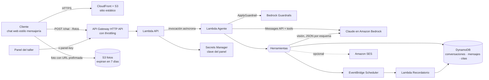

# AWS-Agent-Test · Agente de citas para un taller mecánico

Demo del taller práctico de la charla **"IA Generativa en 2026"** para AWS User Groups.

Un cliente escribe en un chat **con estilo de app de mensajería** y un agente de IA:

1. Obtiene la marca y el modelo del auto. Si el cliente no está seguro, puede mandar una **foto (opcional)**: el agente la identifica con visión y **le pide confirmación**.
2. Averigua qué servicio necesita y propone horarios reales.
3. Agenda la cita cuando el cliente acepta y **asigna un mecánico** según la especialidad y la carga de trabajo.
4. La cita aparece en el **panel del taller** en tiempo real.
5. Confirma en el chat (y por correo, si se configura) y programa un **recordatorio** automático.

> ⚠️ **Proyecto educativo, no apto para producción.** La interfaz *imita* una app de mensajería, pero **no usa WhatsApp ni ningún servicio de Meta**. Usa solo datos ficticios.

## Arquitectura



| Pieza | Servicio | Qué hace |
|---|---|---|
| Chat y panel | S3 + CloudFront | HTML/JS estático, sin build |
| Entrada | API Gateway HTTP API + Lambda | Valida, limita el ritmo y encola cada turno |
| Agente | Lambda + **Claude en Bedrock** (SDK oficial `anthropic`) | Loop de razonamiento con herramientas |
| Visión | Claude con salida JSON forzada por esquema | Clasifica el vehículo de la foto |
| Seguridad | **Bedrock Guardrails** (`ApplyGuardrail`) | Filtros de contenido, ataques de prompt, tema denegado (fraude vehicular), bloqueo de tarjetas y contraseñas |
| Datos | DynamoDB (con TTL) | Conversaciones, mensajes y citas |
| Recordatorios | EventBridge Scheduler → Lambda | Mensaje en el chat (y correo opcional) |
| Correo | Amazon SES (opcional) | Confirmación y recordatorio |
| Auditoría | CloudWatch Logs | Cada llamada a herramienta queda registrada |

### Cómo piensa el agente

```
cliente escribe → Guardrail (entrada) → Claude decide → herramienta → resultado → Claude decide → … → Guardrail (salida) → chat
```

Herramientas (`backend/taller/herramientas.py`):

| Herramienta | Regla que se valida **en código**, no solo en el prompt |
|---|---|
| `identificar_vehiculo` | La foto solo se lee desde la carpeta de esa conversación |
| `confirmar_vehiculo` | Requiere `confirmado_por_cliente = true`, con marca y modelo dichos por el cliente o confirmados después de la foto |
| `consultar_disponibilidad` | Horario del taller, 2 h de anticipación, máximo 30 días |
| `agendar_cita` | Vehículo confirmado, horario confirmado, máximo 2 citas activas y reserva atómica del horario |
| `mis_citas` / `cancelar_cita` | Solo las citas del teléfono de la conversación, con confirmación |
| `cargar_skill` | Solo skills del catálogo local |

### Skills

`backend/taller/skills/*/SKILL.md` sigue el formato abierto de [Agent Skills](https://agentskills.io): un encabezado YAML (`name`, `description`) y las instrucciones en Markdown. El agente solo ve el **nombre y la descripción** de cada skill, y carga el contenido completo con `cargar_skill` cuando lo necesita (divulgación progresiva). Así el prompt se mantiene corto y el conocimiento del taller vive en archivos fáciles de editar:

- `politica-citas`: horarios, anticipación, cancelaciones y qué traer.
- `diagnostico-preliminar`: preguntas guía por síntoma y señales de alerta.
- `cotizacion-servicios`: precios de referencia (ficticios).

### Guardrails y decisiones de seguridad

- **La foto nunca entra a la conversación del agente.** Un clasificador aislado la convierte en un JSON con esquema fijo y campos truncados. Un texto escrito dentro de la imagen no puede darle instrucciones al agente.
- **Humano en el ciclo.** El cliente confirma la marca y el horario. Sin esa confirmación, las herramientas rechazan la acción.
- **Bedrock Guardrails** en la entrada y en la salida.
- **Límites de uso.** Throttling en API Gateway, 20 mensajes cada 10 minutos por conversación, fotos de 5 MB como máximo y URL prefirmada de 5 minutos.
- **Retención mínima.** Las conversaciones y los mensajes expiran en 7 días (TTL) y las fotos también (ciclo de vida de S3).
- **Panel protegido** con una clave guardada en Secrets Manager.
- **Mínimo privilegio.** Cada Lambda recibe solo los permisos que usa.

Qué faltaría para producción: autenticación real (por ejemplo, Cognito), verificación del número de teléfono, cifrado con KMS propio, WAF, revisión legal del manejo de datos personales, pruebas de carga y evaluaciones (evals) del agente.

## Requisitos

- Cuenta de AWS con acceso a un modelo **Claude en Amazon Bedrock**.
  - Si Bedrock responde *"Model use case details have not been submitted"*, completa una vez el formulario de caso de uso de Anthropic en la consola de Bedrock (*Model catalog* → un modelo de Anthropic → *Submit use case details*).
- AWS CLI configurado, Python 3.12, Node.js 18+ y **Docker** encendido (CDK empaqueta la Lambda en un contenedor).

## Despliegue

```bash
python -m venv .venv
.venv\Scripts\activate          # Linux/macOS: source .venv/bin/activate
pip install -r requirements-dev.txt -r infra/requirements.txt
cd infra
npx aws-cdk bootstrap           # solo la primera vez por cuenta y región
npx aws-cdk deploy --outputs-file ../cdk-outputs.json
```

Al terminar, CDK imprime:

- `ChatUrl`: el chat del cliente.
- `PanelUrl`: el panel del taller.
- `PanelKeyCommand`: el comando para obtener la clave del panel.

### Parámetros opcionales (`-c clave=valor`)

| Parámetro | Por defecto | Uso |
|---|---|---|
| `modelId` | `us.anthropic.claude-opus-4-6-v1` | Perfil de inferencia de Claude en Bedrock (usa el modelo más reciente que tenga habilitado tu cuenta) |
| `modoRecordatorio` | `demo` | `demo` envía el recordatorio 2 minutos después de agendar; `real`, 24 h antes de la cita |
| `senderEmail` | *(vacío)* | Remitente verificado en SES para enviar correos. En el sandbox de SES el destinatario también debe estar verificado |

Ejemplo: `npx aws-cdk deploy -c modelId=us.anthropic.claude-opus-5 -c senderEmail=tu@correo.com`

## Pruebas

```bash
pytest -q                               # unitarias: moto + cliente falso de Claude, sin AWS
python scripts/probar_modelos.py        # qué modelos Claude puede invocar tu cuenta
python scripts/smoke_test.py            # de punta a punta contra el stack desplegado
python scripts/smoke_test.py --flujo    # conversación completa hasta agendar una cita
```

> ¿Eres un agente de código o quieres la ruta más corta? Sigue [AGENTS.md](AGENTS.md).

## Desarrollo local del frontend

Crea `frontend/config.json` con la URL del API (este archivo está en `.gitignore`):

```json
{ "apiUrl": "https://xxxx.execute-api.us-east-2.amazonaws.com" }
```

Después ejecuta `python -m http.server 8000 -d frontend` y abre `http://localhost:8000`. El API ya permite ese origen.

## Costos y limpieza

Todo es serverless y se cobra por uso. El costo principal son las llamadas al modelo. Para borrar todo:

```bash
cd infra
npx aws-cdk destroy
```

## Estructura

```
backend/taller/     código de las Lambdas (agente, herramientas, visión, guardrails, skills)
frontend/           chat estilo mensajería + panel del taller (HTML/CSS/JS sin build)
infra/              stack de AWS CDK en Python
scripts/            prueba de humo y detector de modelos disponibles
tests/              pruebas con pytest + moto
AGENTS.md           guía rápida para agentes de código (CLAUDE.md la importa)
```
